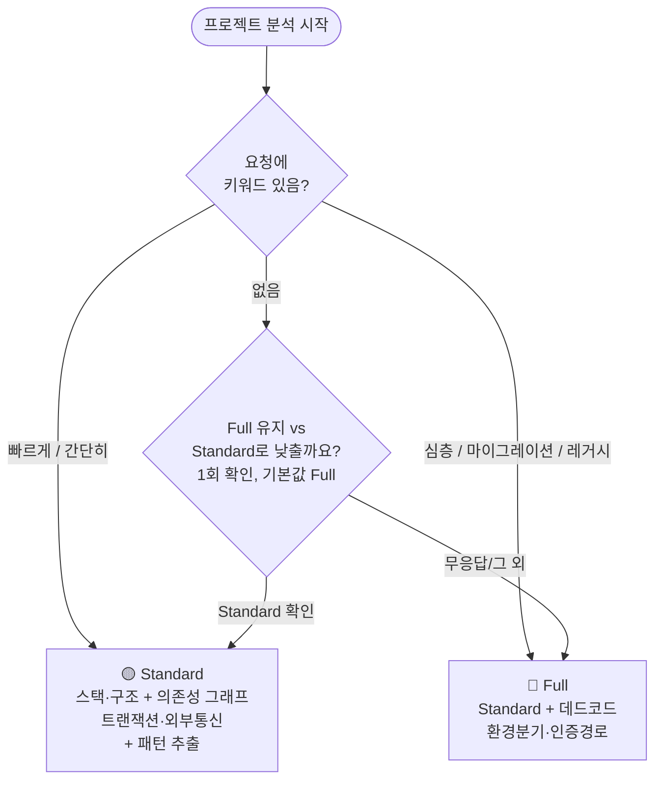
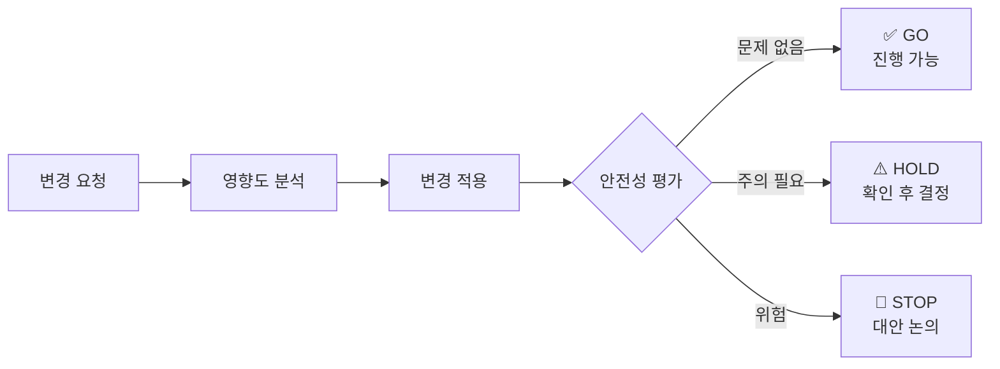

# AX Navi

> **ITO/SI 조직을 위한 Claude Code 확장 하네스**
>
> 처음 투입된 프로젝트에서 _"이 코드 뭐야?"_ 부터 _"이 변경 안전해?"_ 까지,
> Claude가 프로젝트를 이해하고 작업을 함께 수행할 수 있도록 돕는 에이전트 팀 + 워크플로우 도구 모음입니다.

<!-- 이름: ax = AI Transformation, navi = navigator. 낯선 코드베이스의 지도를 만들고 길을 안내한다는 뜻입니다. -->

---

## 🧬 설계 철학

빌려온 방법론 2종과 자체 원칙 1종을 SM 현장에 맞게 접목했습니다.

```
분석 전                    분석 중              분석 후
──────────────────────     ─────────────────    ─────────────────
근거를 먼저 만든다     →   파이프라인 실행   →  결과가 맞는가?
(결정론적 전수 인덱싱)     (Superpowers)        (Karpathy)
```

| 출처 | 핵심 아이디어 | AX Navi 적용 |
|------|-------------|----------------|
| 자체 원칙 ([Building effective agents](https://www.anthropic.com/engineering/building-effective-agents)와 결이 같음) | 가능한 곳은 결정론적 코드로, 판단이 필요한 곳에만 LLM | **Phase 2-0.5 전수 인덱싱** — analyzer보다 먼저 `build-index.mjs`가 심볼·호출 그래프·SQL 사용처·트랜잭션 경계를 LLM 없이 전수 파싱하고, 리포트·검증·집계도 스크립트가 맡는다 |
| [obra/superpowers](https://github.com/obra/superpowers) | 에이전트마다 프롬프트를 주지 말고 파이프라인에 방법론을 심어라 | **단계별 검증 파이프라인** — analyzer → writer → pattern-extractor → validator → eval (qa·wiki는 온디맨드) |
| [Andrej Karpathy](https://karpathy.bearblog.dev) | 출력을 스스로 평가 → 실패 원인 분석 → 재생성 (AutoResearch) | **Phase 4 Eval Loop** — 4차원 품질 채점 → 80점 미만 시 타겟 재생성 (1회, 점수 하락 시 초기 결과 유지) |

> 작업 전 목적·범위를 먼저 정리하고 싶으면 `spec-gate` 스킬을 따로 호출할 수 있습니다. harness-init이 자동으로 부르지는 않습니다.

---

## 🤔 이게 왜 필요한가요?

Claude Code를 아무 설정 없이 사용하면 매번 _"이 프로젝트가 뭔지"_ 처음부터 설명해야 합니다.
AX Navi는 프로젝트를 **한 번 분석해 Claude가 기억할 수 있는 형태로 저장**합니다.

그 결과, 이후 작업에서 Claude는 다음을 알고 시작합니다.

- 🏗️ 이 프로젝트의 아키텍처와 레이어 구조
- 🔌 어떤 DB·외부 시스템과 연결되어 있는지
- 📐 코드 작성 컨벤션 (네이밍, 계층 패턴, 예외 처리 방식)
- 🕸️ 어떤 함수가 어떤 함수를 호출하는지 (호출 그래프)
- 🔒 트랜잭션 경계, 인증/인가 경로

### 추측 대신 근거

인덱싱은 LLM이 아니라 결정론적 스크립트(`build-index.mjs`)가 수행합니다. 심볼·호출 그래프·SQL 사용처·트랜잭션 경계·외부 통신은 전수 파싱 결과이며, 분석 리포트의 상당 부분도 그 JSON에서 기계 생성됩니다(`analyzer_index_summary.py`·`pattern_tally.py`). 패턴 프로필은 실제로 존재하는 근거 파일이 있어야 채택됩니다. 이후 모든 작업이 이 근거 위에서 진행되도록 하는 것이 이 도구의 목적입니다.

### 범용 ITO 지원 원칙

Java/Spring, JavaScript/TypeScript(Vue·React), Python, Go, C#/.NET의 결정적 소스 분석을 공통 워크플로우에서 사용합니다. ASP.NET Core route·생성자 DI, WinForms event, Nexacro Form·Dataset·transaction은 전용 어댑터로 보강됩니다.

다만 "파일을 발견했다"를 "안전하게 자동 수정할 수 있다"로 과장하지 않습니다. 인덱서는 확장자와 파일별로 `FULL/PARTIAL/UNSUPPORTED`를 기록하며, WinForms Designer·DevExpress·XFDL·JSP/Struts XML 같은 PARTIAL 대상은 실제 빌드·UI·통합 검증 전까지 자동 변경 판정이 `HOLD`입니다. 생성된 wiki의 **유지보수 지원 현황**에서 프로젝트별 상태를 확인할 수 있습니다.

이 정보를 바탕으로 영향도 분석, 안전 변경, 신규 기능 생성, 마이그레이션 계획 같은 작업을 **자연어로** 요청할 수 있게 됩니다.

---

## 📦 설치 방법

최신 Claude Code에서 아래 두 명령을 실행하면 `AX-NAVI-V2` GitHub 저장소를 마켓플레이스로 등록하고 플러그인을 사용자 범위에 설치할 수 있습니다. 마켓플레이스 등록은 최초 1회만 필요합니다.

### 가장 빠른 설치 (터미널)

PowerShell·macOS·Linux에서 아래 두 줄을 그대로 실행하세요.

```bash
claude plugin marketplace add Malburi/AX-NAVI-V2
claude plugin install ax-navi@ax-navi --scope user
```

이미 `ax-navi` 마켓플레이스를 등록했다면 첫 줄은 건너뛰고 두 번째 줄만 실행하면 됩니다. 설치 후 새 Claude Code 세션을 시작하거나 `/reload-plugins`를 실행하세요.

기존 `ax-navi` 마켓플레이스가 구 저장소 `Malburi/AX-NAVI`를 가리키는 경우에는 V2로 전환합니다.

```bash
claude plugin uninstall ax-navi@ax-navi --scope user
claude plugin marketplace remove ax-navi
```

제거 후 위 "가장 빠른 설치"의 두 줄을 그대로 실행하면 V2 등록과 설치가 끝납니다.

기존 마켓플레이스의 출처가 이미 `AX-NAVI-V2`라면 제거하지 말고 `claude plugin marketplace update ax-navi` 후 설치 명령만 실행하세요.

### 1단계 — 마켓플레이스 등록 (최초 1회)

Claude Code 어느 프로젝트에서나 실행합니다.

```
/plugin marketplace add Malburi/AX-NAVI-V2
```

### 2단계 — 플러그인 설치

```
/plugin install ax-navi@ax-navi
```

설치 확인은 다음과 같습니다.

```
/plugin list
```

`ax-navi@ax-navi — enabled`가 보이면 됩니다. ✅

### 3단계 — 구성 요소 로딩 확인

설치 결과가 재로딩을 요구할 때만 아래 명령을 실행합니다.

```
/reload-plugins
```

플러그인 상세 화면에서 24개 스킬(워크플로우 17 + 단축 별칭 7)과 19개 에이전트를 확인할 수 있습니다.

```
/plugin details ax-navi@ax-navi
```

첫 실행은 이름이 겹치지 않도록 네임스페이스를 포함해 호출할 수 있습니다.

```
/ax-navi:harness-init
```

터미널에서 비대화형으로 설치하려면 위 [가장 빠른 설치](#가장-빠른-설치-터미널)의 두 줄을 실행한 뒤 `claude plugin details ax-navi@ax-navi`로 확인하면 됩니다.

> 💡 **설치가 안 될 때** — 저장소 루트에서 `claude plugin validate . --strict`를 실행하고 Claude Code를 최신 버전으로 갱신하세요.

---

## 🚀 처음 시작하기 (하네스 초기화)

분석하고 싶은 **프로젝트 루트**에서 Claude Code를 열고 아래 중 하나를 입력하세요.

```
"하네스 초기화해줘"
"이 프로젝트 Claude 설정해줘"
"harness init"
```

`harness-init` 스킬이 자동으로 실행되어 아래 순서로 진행됩니다.


시작 전에 질문 두 개가 나올 수 있습니다 — ① 프로젝트 구성(단일/모노레포/분리저장소 1:1/부분범위/허브형 1:N — 백엔드 1개+클라이언트 2개 이상, 예: 웹+모바일+관리자), ② Tier 확인(기본 Full 유지할지). 요청문에 구성·경로를 이미 적었으면 ①은 생략되고, `"빠르게"`(Standard)·`"심층"`(Full) 같은 키워드를 붙이면 ②도 질문 없이 바로 확정됩니다.

완료되면 프로젝트 루트에 `CLAUDE.md`와 `.claude/` 폴더가 생깁니다.
이 파일들을 git에 커밋해 팀원과 공유하세요.

```bash
git add CLAUDE.md .claude/
git commit -m "docs: add project harness"
```

> ⏱️ **소요 시간** — Standard 3~5분 · Full 10분 내외

---

## ⚡ 분석 깊이 (2-Tier)

harness-init의 기본 Tier는 **Full**입니다 — 레거시 유지보수는 얕은 분석이 놓치는 위험(미해결 관계·인증 우회·트랜잭션 경계)이 재작업 비용보다 크다는 전제입니다.



경계면 QA와 wiki 생성은 Tier와 무관하게 항상 온디맨드입니다 — 초기화 완료 후 선택 작업 메뉴에서 고를 때만 실행됩니다(토큰 절감).

| Tier | 선택 방법 | 적합한 프로젝트 | 소요 시간 |
|------|---------|--------------|---------|
| 🟡 **Standard** | `"빠르게"`/`"간단히"` 키워드 또는 다운그레이드 확인 질문에서 선택 | 일반적인 웹 서비스, 소규모 모듈 | 3~5분 |
| 🔴 **Full** (기본값) | 아무것도 안 하거나 `"심층"`/`"마이그레이션"` 키워드 | 대형 레거시, 마이그레이션 대상 | ~10분 |

---

## 💬 하네스 초기화 이후 — 일상 작업에서 쓰는 법

하네스가 설치된 프로젝트에서는 자연어로 아래 작업을 요청할 수 있습니다.

### 🔍 코드 이해

```
"주문 취소 로직 어떻게 돼?"
```
→ `trace-logic` → 진입점 · Controller · Service · Repository · DB 쿼리까지 전체 흐름 리포트

```
"결제 관련 코드 어디 있어?"
```
→ `find-feature` → 관련 파일 · 클래스 · 메서드 · SQL ID 목록

```
"이 PL/SQL 뭐하는 코드야?"
```
→ `legacy-decoder` → 비즈니스 의도 역공학 리포트

---

### 🛡️ 변경 전 확인

```
"OrderService.cancel 수정하면 어디 영향가?"
```
→ `analyze-impact` → 직접 호출자, 트랜잭션 경계, 관련 테스트, 화면 영향 정리

```
"이 변경 안전하게 적용해줘"
```
→ `safe-modify` → 영향 분석 → 실제 기준 패턴 선택 → 적용 → 패턴 적합성·테스트/빌드 검증 → 안전성 판정



> HOLD / STOP 이 나오면 Claude가 이유와 권고 조치를 함께 알려줍니다. **자동 수정은 하지 않습니다.**

---

### 🏗️ 신규 기능 개발

```
"환불 기능을 프로젝트 컨벤션에 맞게 만들어줘"
```
→ `scaffold-feature` → 기존 패턴 분석 → Controller · Service · Repository · DTO · 테스트 골격 일괄 생성

---

### 🗄️ SQL 리뷰

```
"이 쿼리 문제없어? SELECT * FROM orders WHERE ..."
```
→ `review-sql` → 사용처 · 인덱스 활용 · N+1 위험 · SQL 인젝션 · DDL 영향 종합 리포트

---

### 🚚 마이그레이션

```
"Spring Boot 3으로 마이그레이션 계획 짜줘"
"Oracle에서 PostgreSQL로 전환 계획 짜줘"
```
→ `plan-migration` → 인벤토리 → 매핑 테이블 → 단계별 계획 → 리스크 레지스터 → 롤백 플랜

---

### 📝 문서 동기화

```
"코드 바꿨는데 문서 동기화해줘"
```
→ `doc-syncer` → CLAUDE.md · README · API 문서 업데이트 권고 목록

---

## ⌨️ 단축 명령 (별칭)

자주 쓰는 7종은 슬래시 한 번으로 부를 수 있습니다. 뒤에 쓴 내용은 그대로 본편 스킬에 전달됩니다.

| 단축 | 위임 대상 | 예시 |
|------|---------|------|
| `/modify` | `safe-modify` | `/modify 주문 취소 버튼 오류 고쳐줘` |
| `/impact` | `analyze-impact` | `/impact ORDER 테이블에 STATUS 컬럼 추가` |
| `/scaffold` | `scaffold-feature` | `/scaffold 주문 취소 기능` |
| `/find` | `find-feature` | `/find 결제 승인 처리` |
| `/flow` | `trace-logic` | `/flow 로그인 처리` |
| `/sql` | `review-sql` | `/sql SELECT * FROM ORDERS WHERE STATUS = 'N'` |
| `/wiki` | `generate-wiki` | `/wiki` |

> `trace-logic`의 별칭이 `/trace`가 아니라 `/flow`인 이유는 하네스가 대상 프로젝트마다 로컬 `trace` 스킬을 배포하기 때문입니다(이름 충돌 방지).
> 다른 플러그인과 이름이 겹치면 `/ax-navi:safe-modify`처럼 네임스페이스를 붙이면 확실합니다.

---

## 🏭 운영 환경 키워드

변경 작업 요청 시 상황을 알려주면 Claude가 안전성 판단 기준을 맞춰줍니다.

| 상황 | 키워드 예시 |
|------|-----------|
| 🏢 운영 서버 반영 | "운영 패치야", "프로덕션 배포 전이야" |
| 🚨 긴급 수정 | "긴급 핫픽스야" — 변경 범위를 작게 제한 |
| 🏚️ 레거시 코드 | "레거시 손보는 거야" — 컨벤션 기준 완화 |
| 🎯 고객 데모 직전 | "고객 데모 직전이야" — 외부 영향 가중치 높임 |
| 🌙 야간 배치 | "야간 배치 관련이야" |

---

## 📁 하네스가 만드는 파일들

초기화 후 프로젝트에 생기는 파일 구조입니다.

```
프로젝트/
├── CLAUDE.md                          ← 🧠 이 프로젝트의 핵심 가이드 (git 커밋 권장)
└── .claude/
    ├── ito-guide.md                   ← 📖 하네스 사용 설명서 (초기화 시 자동 생성)
    ├── skills/                        ← ⚙️ 프로젝트 전용 스킬 (git 커밋 권장)
    │   ├── trace.md
    │   ├── scaffolder.md
    │   └── find-logic.md
    ├── agents/
    │   └── domain-expert.md           ← 🎓 이 프로젝트의 도메인 지식
    └── patterns/                      ← 📐 코드 컨벤션 패턴
        ├── controller_pattern.md
        ├── service_pattern.md
        ├── dao_pattern.md
        ├── client_pattern.md          ← Legacy Static JS 탐지 시에만 생성
        └── ...
```

> `analyze-impact`/`safe-modify`/`scaffold-feature`/`vibe`/`plan-migration`/`review-sql`은 프로젝트별로
> 내용이 달라지지 않는 스킬이라 로컬 파일을 만들지 않습니다 — 플러그인이 설치된 이상 바로 사용 가능하며,
> CLAUDE.md의 자동 워크플로우 표에 이름이 등록됩니다.

```
_workspace/                            ← 🔧 분석 산출물 (.gitignore 권장)
├── 00_init_scope.md                   ← 구성 확인 리포트 (Phase -1)
├── 01_analyzer_report.md              ← 분석 리포트
├── 06_eval_report.md                  ← 품질 Eval 결과 (Phase 4)
├── index/                             ← ⚡ JSON 인덱스 (후속 작업 고속화)
│   ├── call_graph.json                ← 함수 호출 그래프
│   ├── symbols.json                   ← 클래스·메서드 위치 인덱스
│   ├── sql_usage.json                 ← SQL ID ↔ 호출 위치
│   ├── transactions.json              ← 트랜잭션 경계
│   ├── external_io.json               ← 외부 시스템 연결
│   ├── client_index.json              ← JS↔JSP 매핑 (Legacy Static JS 탐지 시)
│   └── ...
├── reports/                           ← 📋 온디맨드 작업 리포트(스킬별 1회성 산출물)
│   ├── impact_<slug>.md               ← 영향도 분석 결과
│   ├── safety_<slug>.md               ← 안전성 평가 결과
│   └── ...                            ← trace_/found_/sql_review_/docs_sync_/api_drift_report 등
└── wiki/                              ← 🌐 generate-wiki 산출물
```

> 💡 `CLAUDE.md`와 `.claude/`는 팀원과 공유하기 위해 git에 커밋하세요.
> `_workspace/`는 런타임 산출물이므로 `.gitignore`에 추가를 권장합니다.

---

## 🗺️ 시스템 지도 (wiki)

초기화가 끝난 뒤 `"위키 만들어줘"` 또는 `/wiki`를 실행하면 분석 결과가 열람 가능한 문서 세트로 변환됩니다. 재서술이 아니라 인덱스를 그대로 렌더링하는 방식이라 LLM 호출이 들어가지 않습니다.

```
_workspace/wiki/
├── Home.md · architecture.md · api-endpoints.md · database.md
├── external-systems.md · patterns.md · maintenance-support.md ...
├── _sidebar.md · _navbar.md          ← Docsify 네비게이션
├── serve.bat                          ← 로컬 열람용
└── call-graph.html                    ← 데이터 인라인 포함, file://로 바로 열림
```

`call-graph.html`은 외부 CDN을 쓰지 않는 단일 파일이라 **폐쇄망에서도 그대로 열립니다**. 3단 구조로 되어 있습니다.

- **모듈 뷰** (시작 화면) — 단일 클릭은 모듈 설명(구성 타입 분포·많이 호출되는 멤버·연결된 모듈), 더블 클릭은 드릴다운
- **엔드포인트 흐름** — 진입점부터 이어지는 메서드 체인을 클릭해 해당 노드로 이동하고, 테이블 칩은 DB 테이블 노드로 연결
- **전체 함수 그래프** (고급) — 허브와 이웃만 먼저 그리고 클릭·검색으로 확장

DB 테이블 노드는 읽기/쓰기 사용처를 갈라 보여주고, 외부 I/O는 배지로 표시됩니다. 설명이 없는 노드는 조용히 비우지 않고 "설명 없음"을 명시하며 `trace-logic` 안내와 노드 id 복사 버튼을 제공합니다.

생성된 wiki는 `publish-wiki`로 중앙 허브(`wiki-hub`)에 발행해 여러 시스템을 한곳에서 열람·검색·버전 관리할 수 있습니다.

---

## 🌐 지원 스택

ITO/SI 현장에서 자주 만나는 레거시를 포함해 자동으로 탐지합니다.

| 카테고리 | 지원 스택 |
|---------|----------|
| ☕ Java EE 레거시 | Struts 1.x/2.x, Spring 3~4, iBatis, EJB 2, JSP/JSTL |
| 🍃 Spring | Spring Boot 2/3, Spring MVC, MyBatis, Spring Data JPA, Spring Security |
| 🏛️ 전자정부 | egovframework |
| 🟩 Node.js | Express, NestJS, Next.js, Fastify, Koa |
| 🖥️ 프런트엔드 | Vue 2/3, Nuxt 2/3, Pinia/Vuex, React, Angular 15+, AngularJS 1.x, Svelte |
| 📜 Legacy Static JS | jQuery 1.x~3.x, 빌드 도구 없는 JSP+JS 혼합 (JS↔JSP 매핑, onInit/onSaveData 규약, eval AJAX 자동 추출) |
| 🐍 Python | FastAPI, Django, Flask |
| 🔷 .NET | .NET Framework 2~4, .NET Core, .NET 5~8, ASP.NET Core |
| 🖼️ 데스크톱·전문 UI | WinForms, DevExpress, Nexacro, XFDL (탐지 범위 — 자동 변경 판정은 `HOLD`) |
| 🗄️ DB | Oracle, PostgreSQL, MySQL/MariaDB, Tibero, Altibase, SQL Server |
| 🔄 마이그레이션 경로 | Struts→Spring, iBatis→MyBatis/JPA, Vue 2→3, Vuex→Pinia, Oracle→PostgreSQL 등 |

---

## ❓ 자주 묻는 질문

**Q. 초기화할 때 질문이 너무 많아요. 바로 시작하고 싶어요.**

"빠르게 하네스 초기화해줘" 처럼 **"빠르게"** 를 붙이거나 "skip spec"을 포함하면 질문 없이 바로 분석으로 넘어갑니다.

**Q. 품질 점수(Eval)가 낮으면 어떻게 되나요?**

80점 미만이면 낮은 차원(커버리지·정확도·실행가능성·컨텍스트 품질)만 골라 자동으로 재생성합니다. 전체 재실행이 아닌 **타겟 재생성**이라 시간이 크게 늘지 않습니다. 재생성 후 점수가 오히려 낮아지면 초기 결과를 유지합니다.

**Q. harness를 완전히 제거하고 싶어요.**

```
"하네스 삭제해줘"
"harness clean"
```

→ `harness-clean` 스킬이 삭제 대상 목록을 먼저 보여주고 확인을 받습니다. 자동 삭제 없음.
플러그인 자체를 제거하려면 확인 후 안내해 드립니다.

```
/plugin uninstall ax-navi@ax-navi
```

**Q. 하네스를 한 번 만들면 코드가 바뀌었을 때는?**

인덱스를 증분 갱신할 수 있습니다.
```
"인덱스 갱신해줘"
```
큰 변경이 있었다면 `"하네스 다시 초기화해줘"` 로 전체 재실행도 가능합니다.

**Q. 초기화 후 어떻게 쓰는지 모르겠어요.**

초기화가 끝나면 `.claude/ito-guide.md` 파일이 자동으로 생성됩니다.
이 파일에는 이 프로젝트에 맞는 스킬 트리거 예시, 실전 시나리오, 주의사항이 담겨 있습니다.

```
"ito-guide 보여줘"
```

**Q. 특정 부분만 다시 만들고 싶어요.**

```
"스킬만 다시 생성해줘"
"패턴만 다시 추출해줘"
"validator만 다시 실행해줘"
```

**Q. _workspace/ 폴더가 너무 커요.**

분석이 끝난 후 `_workspace/`는 지워도 됩니다. 단, `_workspace/index/`는 영향도 분석·안전 변경 등에서 참조하므로 남겨두는 편이 좋습니다.

**Q. ✅ GO / ⚠️ HOLD / 🛑 STOP 이 나왔는데 어떻게 해야 하나요?**

- ✅ **GO** — 진행해도 안전합니다.
- ⚠️ **HOLD** — 주의가 필요한 부분이 있습니다. Claude가 상세 내용을 알려줍니다. 확인 후 결정하세요.
- 🛑 **STOP** — 현재 방식으로는 진행하지 않는 것을 권고합니다. 대안을 논의하세요.

Claude는 HOLD/STOP 상황에서도 자동 수정을 하지 않습니다. **판단은 항상 사람이 합니다.**

**Q. 백엔드와 프론트엔드가 저장소가 나뉘어 있어요.**

`pair-init`으로 두 저장소를 연결하면 API 계약을 추출해 드리프트를 검증하고, `cross-repo-scaffold`·`cross-repo-modify`로 양쪽에 동시에 반영할 수 있습니다. 백엔드 1개에 클라이언트 여러 개인 허브형(1:N)도 지원합니다.

---

## 📚 에이전트 & 스킬 전체 목록

<details>
<summary>펼쳐보기</summary>

### ⚙️ 워크플로우 스킬 (17종)

| 스킬 | 트리거 예시 | 역할 |
|------|-----------|------|
| `spec-gate` | "작업 전 범위 정해줘" | 소크라테스식 명세 명확화 (단독 실행 가능) |
| `harness-init` | "하네스 초기화해줘" | 명세 확인 → 분석 → 생성 → 검증 → eval 오케스트레이터 |
| `harness-clean` | "하네스 삭제해줘" | 생성된 harness 파일 전체 안전 제거 |
| `analyze-impact` | "영향도 분석해줘" | 변경 영향 범위 분석 |
| `safe-modify` | "안전하게 적용해줘" | 영향 분석 + 적용 + 안전성 판정 |
| `scaffold-feature` | "컨벤션 따라 만들어줘" | 전 레이어 신규 기능 생성 |
| `plan-migration` | "마이그레이션 계획 짜줘" | 스택 전환 계획 수립 |
| `review-sql` | "SQL 점검해줘" | SQL 종합 리뷰 |
| `trace-logic` | "로직 어떻게 돼?" | 처리 흐름 추적 |
| `find-feature` | "어디 있어?" | 기능·키워드로 코드 위치 탐색 |
| `vibe` | "알아서 해줘" | 사소한 작업은 빠르게 처리하고 위험 변경은 안전 워크플로우로 승격 |
| `generate-wiki` | "위키 만들어줘" | 도메인·아키텍처·패턴·API·DB wiki + 시스템 지도 생성 |
| `publish-wiki` | "위키 발행해줘" | 생성된 wiki를 중앙 wiki-hub DB에 발행 |
| `wiki-hub` | "위키 허브 실행해줘" | 여러 시스템 wiki 통합 열람·검색 |
| `pair-init` | "백엔드 프론트 연결해줘" | 분리 저장소 API 계약 연결 |
| `cross-repo-scaffold` | "전체 스택 기능 만들어줘" | 백엔드와 선택한 클라이언트에 신규 기능 동시 생성 |
| `cross-repo-modify` | "양쪽 다 수정해줘" | API 영향이 있는 기존 기능을 관련 저장소에 안전 반영 |

### ⌨️ 단축 별칭 (7종)

`/modify` · `/impact` · `/scaffold` · `/find` · `/flow` · `/sql` · `/wiki` — 절차를 재정의하지 않고 본편 스킬로 위임하는 얇은 층입니다. 상세는 [단축 명령](#-단축-명령-별칭) 절을 참고하세요.

### 🤖 에이전트 (19종)

| 에이전트 | 역할 | 모델 |
|---------|------|------|
| `spec-clarifier` | 소크라테스 인터뷰 + 모호성 점수 + 명세 리포트 (spec-gate 스킬 전용) | sonnet |
| `analyzer` | 코드베이스 분석 + 인덱스 생성 | claude-sonnet-5 |
| `writer` | 하네스 파일 생성 | sonnet (모든 Tier) |
| `pattern-extractor` | 코드 컨벤션 패턴 추출 (Legacy Static JS 포함) | sonnet |
| `pattern-conformance` | 변경 코드와 선택된 실제 기준 파일의 패턴 적합성 판정 | sonnet |
| `validator` | 하네스 구조 검증 | sonnet |
| `qa` | 경계면 교차 비교 (온디맨드, Phase 3.6 메뉴에서 선택 시 Phase 3.7에서 실행) | sonnet |
| `harness-evaluator` | 4차원 품질 평가 + 타겟 재생성 지시 (Phase 4) | sonnet |
| `pipeline-runner` | harness-init의 결정론적 스크립트 블록(index·assemble·verify·wiki) 대리 실행 후 요약만 반환 (토큰 절감 계층) | sonnet |
| `impact-analyzer` | 변경 영향도 분석 | claude-sonnet-5 |
| `change-safety` | 안전성 평가 (GO/HOLD/STOP) | sonnet |
| `migration-planner` | 마이그레이션 계획 수립 | opus |
| `test-generator` | 회귀 테스트 골격 생성 | sonnet |
| `sql-reviewer` | SQL 다각도 리뷰 | sonnet |
| `legacy-decoder` | 레거시 코드 역공학 | opus |
| `doc-syncer` | 코드 ↔ 문서 동기화 점검 | sonnet |
| `logic-tracer` | 처리 흐름 추적 | sonnet |
| `feature-finder` | 기능·키워드 코드 위치 탐색 | sonnet |
| `api-bridge` | 저장소 간 API 계약 추출·검증·스텁 생성·영향 확인 | sonnet |

</details>

---

## 🖥️ 발표·보고 자료

설치부터 분석·활용·중앙 위키 발행까지 전 과정을 한 파일로 정리한 슬라이드가 있습니다.
브라우저로 열면 바로 발표할 수 있고(← →로 넘김, `O` 목차, `F` 전체화면), `P`로 인쇄하면
그대로 PDF가 됩니다. 외부 CDN·폰트를 쓰지 않아 폐쇄망에서도 열립니다.

```
ax-navi-guide.html        ← 세미나·보고용 슬라이드 (PPT 대체)
```

---

## 📖 문서 사이트

설치·개념·스킬 17종·에이전트 19종·설정·튜토리얼 10편·레퍼런스·FAQ를 한 곳에 정리한 문서 사이트가 `docs/site/`에 있습니다.

- GitHub Pages로 배포하면 `https://<owner>.github.io/AX-NAVI-V2/site/`에서 열립니다 (저장소 Settings → Pages → Branch `main` / `/docs`).
- 로컬에서 보려면 저장소 루트에서 `python -m http.server 3600`을 실행하고 `http://localhost:3600/docs/site/`를 엽니다.
- 폐쇄망 배포용 단일 HTML은 `python agents/lib/site_build.py --out docs/site/dist/ax-navi-docs.html`로 만듭니다. CDN을 참조하지 않습니다.

---

## 🔗 참고

- [neoruler001/harness-new](https://github.com/neoruler001/harness-new) — 기반 4-에이전트 파이프라인
- [Malburi/harness-ito](https://github.com/Malburi/harness-ito) — 메타 하네스 설계 원칙
- [Claude Code 공식 문서](https://docs.anthropic.com/en/docs/claude-code/overview)
- [`docs/user-guide.md`](docs/user-guide.md) — 사용자 설명서 (스킬별 사용법 + SM 실무 시나리오)
- [`docs/workflows.md`](docs/workflows.md) — 스킬별 상세 시나리오
- [`docs/stack-matrix.md`](docs/stack-matrix.md) — 지원 스택 상세 매트릭스
- [`docs/pattern-profile.md`](docs/pattern-profile.md) — 구조화 패턴 프로필·선택·적합성 게이트
- [`docs/role-map.md`](docs/role-map.md) — 스킬·에이전트의 책임과 중복 방지 경계
- [`docs/skill-triggers.md`](docs/skill-triggers.md) — 스킬 트리거 체계와 신규 스킬 추가 절차
- [`docs/index-spec.md`](docs/index-spec.md) — 인덱스 JSON 스펙
- [`docs/harness-description.md`](docs/harness-description.md) — 규모별 비교 분석 (정확도 & 토큰 소비)
- [`docs/wiki-hub.md`](docs/wiki-hub.md) — 중앙 wiki 허브 구조
- [`docs/changelog.md`](docs/changelog.md) — 변경 이력
- [`sql/README.md`](sql/README.md) — 중앙 DB 스키마·담당자/권한 설계와 엔진별 DDL 스크립트
