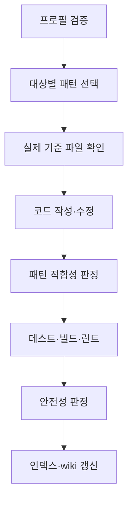

# 구조화 패턴 프로필

AX Navi의 패턴 기능은 코드 스타일을 문서로만 남기지 않는다. 프로젝트의 모듈·레이어·기술 세대별로 실제 기준 파일을 지정하고, 신규 작성과 기존 코드 수정이 그 기준을 따르는지 검증한다.

## 해결하려는 문제

ITO 프로젝트에는 같은 저장소 안에서도 현재 표준, 유지 중인 레거시, 더 이상 복제하면 안 되는 안티패턴이 함께 존재한다. 단순 다수결로 패턴을 뽑으면 오래된 코드가 많다는 이유만으로 신규 코드 표준이 될 수 있다.

구조화 프로필은 다음을 분리한다.

| 상태 | 의미 | 신규 코드 적용 |
|------|------|------|
| `preferred` | 현재 모듈에서 따라야 할 기준 | 적용 |
| `legacy` | 기존 유지보수 시 이해해야 하는 과거 방식 | 신규 코드에는 적용하지 않음 |
| `anti_pattern` | 보안·성능·유지보수상 피해야 하는 방식 | 금지 |

## 생성 산출물

`harness-init`의 pattern-extractor는 두 종류의 산출물을 함께 만든다.

- `.claude/patterns/*.md` — 사람이 읽는 상세 패턴, 빈도, 예시, 안티패턴
- `.claude/patterns/pattern_profile.json` — 도구가 검증·선택하는 프로필, 범위, 실제 기준 파일, 규칙

프로필 한 항목의 핵심 필드는 다음과 같다.

```json
{
  "id": "education-service-current",
  "status": "preferred",
  "confidence": "HIGH",
  "samples_analyzed": 8,
  "scope": {
    "module": "education",
    "layer": "service",
    "stack": "Spring",
    "path_prefixes": ["src/main/java/com/example/education"]
  },
  "reference_files": [
    {
      "path": "src/main/java/com/example/education/EducationApplyService.java",
      "reason": "동일 모듈의 현재 대표 구현"
    }
  ],
  "rules": {
    "dependency_injection": "constructor",
    "transaction_location": "service",
    "exception_type": "BizException"
  }
}
```

## 검증과 선택

프로필은 생성 직후 검증한다.

```bash
python agents/lib/pattern_profile.py validate --root /path/to/project
```

검증기는 중복 ID, 잘못된 상태·신뢰도, 프로젝트 밖 경로, 존재하지 않는 기준 파일, 규칙이 비어 있는 preferred 프로필을 실패로 처리한다. 결과는 `_workspace/pattern_profile_validation.json`에 기록된다.

코드 작성 전에는 대상 경로·모듈·레이어를 입력해 가장 가까운 preferred 프로필을 선택한다.

```bash
python agents/lib/pattern_profile.py select \
  --root /path/to/project \
  --target src/main/java/com/example/education \
  --module education \
  --layer service
```

선택 결과는 `_workspace/reports/pattern_selection.json`에 기록된다. 경로 일치가 가장 큰 가중치를 가지며, 이어 모듈·레이어·신뢰도를 반영한다. 프로필이 없거나 맞는 프로필이 없으면 `basis: "neighbors"`와 이웃 `reference_files`(대상 자신 → 같은 폴더 → 상위 폴더의 같은 확장자 파일, 이름순)를 돌려주고, 작업 보고에는 `기준: 이웃 파일`이 남는다.

## 코드 작업 게이트

`safe-modify`, `scaffold-feature`, `cross-repo-modify`, `cross-repo-scaffold`는 같은 흐름을 사용한다.



최종 GO에는 다음 증거가 모두 필요하다.

- pattern-conformance가 `CONFORM`
- 프로젝트의 필수 테스트·빌드·린트 명령이 exit 0, 또는 적용할 명령이 없거나 도구가 없을 때 `검증 수단 없음` + 정적 대조(DB 스키마·트랜잭션·인증·공통 모듈 변경 제외)
- change-safety가 `GO`

적용할 수 있고 실행 가능한 검증 명령을 돌리지 않은 상태는 `UNVERIFIED`이며 최소 HOLD다. 패턴 적합성 FAIL 또는 필수 검증 실패는 STOP이다.

## Wiki 반영

`generate-wiki`의 `patterns.md`는 구조화 프로필을 먼저 표로 보여준다. 각 프로필의 상태, 모듈·레이어, 신뢰도, 실제 기준 파일을 확인한 뒤 같은 페이지에서 상세 Markdown 패턴을 볼 수 있다. 따라서 wiki가 코드 이해 문서이면서 신규 작업의 컨벤션 근거 역할도 한다.
