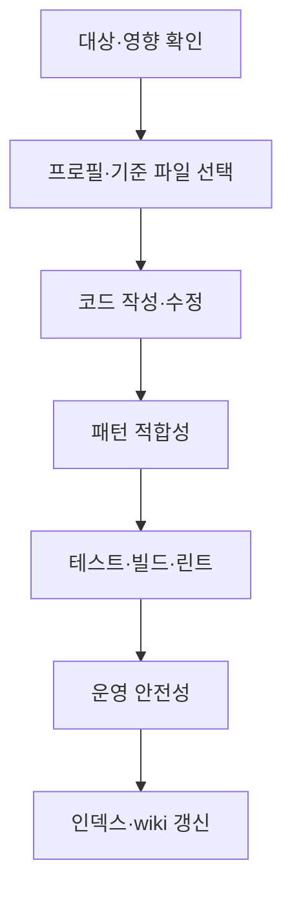

# 스킬·에이전트 역할 맵

스킬은 사용자 요청을 받아 순서·게이트·후속 작업을 지휘하는 오케스트레이터다. 에이전트는 분석·판정·생성처럼 경계가 분명한 전문 작업을 수행한다. 파일 변환·인덱싱·wiki 생성처럼 판단이 필요 없는 작업은 Python/Node 도구가 담당한다.

## 에이전트 도구 제한

소스를 수정하지 않는 에이전트(feature-finder·logic-tracer·impact-analyzer·sql-reviewer·legacy-decoder·change-safety·pattern-conformance·doc-syncer·harness-evaluator·qa·validator·migration-planner·spec-clarifier)는 frontmatter `tools:`에 `Read, Grep, Glob, Bash, Write`만 선언하고 `Edit` 계열을 제외한다. 리포트는 `_workspace/`에 Write로 남기되 기존 소스 파일을 제자리에서 고칠 수 없게 구조로 막는다. "읽기 전용"이라는 문서 약속을 도구 선언으로 보장하는 장치이며 `role-contract.test.mjs`가 고정한다.

## 초기화·수정 모델 정책

`harness-init`과 `/modify` → `safe-modify` → `analyze-impact` 경로는 메인 스킬·위임 호출·재시도를 `claude-sonnet-5`로 고정한다. Standard/Full은 분석 범위만 다르며 Full 분석과 변경 안전성 게이트는 유지한다. `analyzer`·`impact-analyzer`·`writer` 기본 모델과 writer가 새로 만드는 프로젝트 에이전트도 Sonnet 5다. 독립적인 마이그레이션·레거시 해석 등 다른 경로의 기존 모델 정책은 이번 변경 범위가 아니다.

공식 모델 ID는 `claude-sonnet-5`이며 별칭 `sonnet`에 맡기지 않는다. [Sonnet 5 모델 문서](https://platform.claude.com/docs/en/models/sonnet-5/whats-new-sonnet-5), [Claude Code 모델 선택 우선순위](https://code.claude.com/docs/en/sub-agents#choose-a-model)를 참조한다. 호스트 버전·조직 allowlist·클라우드 제공자 설정에 따라 실제 선택이 달라질 수 있으므로 실행 모델을 확인할 수 없으면 고정 실행을 검증했다고 보고하지 않는다. 미지원이나 다른 모델 대체가 확인되면 알리고 중단하며 Opus로 자동 폴백하지 않는다. 전역 설정과 기존 프로젝트에 배포된 에이전트 사본은 자동 수정하지 않는다.

스킬 frontmatter의 메인 모델 지정은 해당 턴에 적용된다. 다음 사용자 메시지에서는 세션 모델이 복원될 수 있다. 여러 턴의 메인 작업까지 계속 Sonnet 5를 쓰려면 사용자가 세션에서 `/model claude-sonnet-5`를 선택한다. 플러그인이 지정한 Agent 호출 모델과 전역/세션 모델은 구분한다.

## 사용자 요청별 스킬

| 목적 | 스킬 | 책임 | 주요 에이전트·도구 |
|------|------|------|------|
| 프로젝트 최초 이해 | `harness-init` | 범위 확인, 인덱싱, 분석, 프로젝트 가이드·패턴 생성, 검증 (wiki·QA는 완료 후 선택 메뉴) | pipeline-runner(index/assemble/verify) + analyzer → writer → pattern-extractor → validator → harness-evaluator, 선택 시 wiki·qa |
| 요구사항 명확화 | `spec-gate` | 범위·목표·제약 인터뷰와 GO 조건 확인 | spec-clarifier |
| 기능 위치 찾기 | `find-feature` | 관련 파일·심볼·SQL 위치 목록 | feature-finder |
| 실행 흐름 이해 | `trace-logic` | 화면/API 진입점부터 DB·외부 시스템까지 흐름 추적 | logic-tracer |
| 변경 영향만 분석 | `analyze-impact` | 변경 시 깨질 수 있는 호출자·DB·외부 계약·테스트 확인 | impact-analyzer, 필요 시 analyzer |
| 기존 코드 수정 | `safe-modify` | 영향 분석, 패턴 선택, 수정, 적합성·실행·운영 안전성 게이트, wiki 갱신 | impact-analyzer, pattern-conformance, change-safety |
| 신규 기능 골격 생성 | `scaffold-feature` | 유사 기능·실제 기준 파일을 따라 레이어별 코드·테스트 골격 생성 | feature-finder, test-generator, pattern-conformance, change-safety |
| 명시적 빠른 수정 | `vibe` | 영향·독립 리뷰 에이전트는 생략하지만 패턴 선택·최소 실행 검증·wiki 최신성 유지 | pattern_profile.py, 프로젝트 검증 명령 |
| SQL 검토 | `review-sql` | SQL 사용처·성능·보안·락·DDL 영향 검토. SQL 실행은 하지 않음 | sql-reviewer |
| 마이그레이션 계획 | `plan-migration` | 인벤토리·매핑·단계·위험·테스트·롤백 계획 수립. 코드 변환은 하지 않음 | migration-planner |
| 분리 저장소 연결 | `pair-init` | 백엔드와 1~N 클라이언트의 경로·API 계약 연결 | api-bridge, 필요 시 harness-init |
| 풀스택 신규 기능 | `cross-repo-scaffold` | 백엔드와 선택 클라이언트 생성, 저장소별 패턴·검증, API 드리프트 게이트 | scaffold-feature, api-bridge, pattern-conformance, change-safety |
| 풀스택 기존 기능 수정 | `cross-repo-modify` | 시작 저장소 영향 분석 후 승인된 파트너에 계약 변경 반영·검증 | impact-analyzer, api-bridge, pattern-conformance, change-safety |
| 로컬 wiki 생성·갱신 | `generate-wiki` | harness 산출물을 탐색 가능한 정적 wiki로 변환 | wiki_generator.py, LLM 없음 |
| 중앙 wiki 발행 | `publish-wiki` | 생성된 wiki를 시스템·컴포넌트·버전 단위로 DB에 저장 | wikihub_db 도구, LLM 없음 |
| 중앙 wiki 열람 | `wiki-hub` | 여러 시스템 검색·버전 비교·복원 UI 실행 | 별도 wiki-hub 런타임 |
| harness 제거 | `harness-clean` | 생성 범위를 확인하고 harness 산출물을 안전하게 제거 | 직접 파일 작업 |

## 별칭 스킬 (단축 호출)

절차를 갖지 않는 얇은 위임 계층이다. `/이름 [내용]` 형태로 호출하면 args를 그대로 본편 스킬에 전달한다.

| 별칭 | 위임 대상 |
|------|------|
| `modify` | `safe-modify` |
| `impact` | `analyze-impact` |
| `scaffold` | `scaffold-feature` |
| `find` | `find-feature` |
| `flow` | `trace-logic` |
| `sql` | `review-sql` |
| `wiki` | `generate-wiki` |

## 에이전트 역할

| 단계 | 에이전트 | 단일 책임 | 하지 않는 일 |
|------|------|------|------|
| 초기 분석 | `analyzer` | 코드·인덱스로 아키텍처·도메인·의존성·DB·외부 연동 분석. `targeted` 모드에서는 지목된 항목만 보정 | 프로젝트 코드 수정, 인덱서 소유 인덱스 파일 직접 편집 |
| 하네스 생성 | `writer` | 프로젝트 전용 가이드 필드·스킬·생성 결정을 작성 | 패턴 추출, 인덱스 재작성 |
| 패턴 추출 | `pattern-extractor` | 모듈·레이어별 preferred/legacy/anti-pattern과 실제 기준 파일 생성 | 업무 코드 생성·수정 |
| 구조 검증 | `validator` | 파일 존재·형식·등록·인덱스·패턴 프로필 계약 검증 | 실용 품질 표본 평가, 코드 수정 |
| 실용 품질 평가 | `harness-evaluator` | 생성된 harness가 실제 작업에 유용한지 표본 평가 | 전체 경계 집합 대조 |
| 경계 QA | `qa` | 코드↔인덱스↔하네스 양방향 비교로 누락·고아 탐지 | 초기화 기본 실행, 코드 수정 |
| 명세 | `spec-clarifier` | 작업 전 모호성 질문·점수·명세 리포트 | 코드 분석·작성 |
| 위치 탐색 | `feature-finder` | 관련 구현 위치 목록 반환 | 전체 실행 흐름 설명 |
| 흐름 추적 | `logic-tracer` | 특정 기능의 호출·데이터 흐름 설명 | 변경 영향 GO/STOP 판단 |
| 영향 분석 | `impact-analyzer` | 변경의 직간접 파급과 위험도 계산 | 코드 적용 |
| 패턴 적합성 | `pattern-conformance` | 변경 코드와 선택된 실제 기준 파일의 일치 여부 판정 | 운영 안전성 종합 평가, 코드 수정 |
| 변경 안전성 | `change-safety` | 영향·패턴 판정·실행 증거를 종합해 GO/HOLD/STOP | 패턴 재추출·독립 재판정, 코드 수정 |
| 테스트 생성 | `test-generator` | 기존 테스트 기준을 따른 회귀 테스트 골격 생성 | 비즈니스 규칙을 추측한 완성 assertion |
| SQL 검토 | `sql-reviewer` | SQL 성능·보안·락·트랜잭션·스키마 영향 판정 | SQL 실행 |
| 레거시 해독 | `legacy-decoder` | 난해한 코드의 동작·의도·사이드 이펙트 역공학 | 리팩터링·수정 |
| 마이그레이션 | `migration-planner` | 전환 작전·위험·검증·롤백 설계 | 실제 코드 변환 |
| API 연결 | `api-bridge` | API 계약 추출·드리프트·스텁·파트너 영향 확인 | 도메인 비즈니스 로직 구현 |
| 문서 점검 | `doc-syncer` | 소스 문서의 stale 항목과 변경 권고 생성 | 파생 wiki 직접 편집, 무승인 문서 수정 |
| 스크립트 실행 | `pipeline-runner` | harness-init의 결정론적 스크립트 블록 실행과 요약 반환 | 분석·판정·생성, 사용자 질문 |

## 혼동하기 쉬운 경계

| 질문 | 담당 | 구분 기준 |
|------|------|------|
| “결제 코드는 어디 있지?” | find-feature / feature-finder | 위치 목록이 목적 |
| “결제 요청이 DB까지 어떻게 가?” | trace-logic / logic-tracer | 실행 순서와 데이터 흐름이 목적 |
| “결제 코드를 바꾸면 뭐가 깨지지?” | analyze-impact / impact-analyzer | 변경 결과와 위험 범위가 목적 |
| “새 코드가 기존 스타일과 같나?” | pattern-conformance | 코드 패턴 일치만 판정 |
| “이 변경을 배포해도 되나?” | change-safety | 패턴·테스트·보안·롤백을 종합 판정 |
| “하네스 파일 형식이 정상인가?” | validator | 구조·계약 검증 |
| “하네스가 실제로 쓸 만한가?” | harness-evaluator | 실용 품질 표본 평가 |
| “코드와 인덱스 양쪽에 누락이 없나?” | qa | 전체 경계 교차 비교 |

## 코드 작업의 공통 완료 조건

`safe-modify`, `scaffold-feature`, cross-repo 작업은 전 단계를 수행한다. `vibe`만 A의 영향 에이전트와 D·F의 독립 리뷰 에이전트를 생략하지만 B·E·G는 유지한다.
