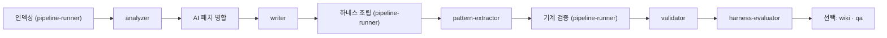

# 에이전트 팀과 파이프라인

AX Navi는 세 층으로 일을 나눈다. 스킬은 사용자 요청을 받아 순서·게이트·후속 작업을 지휘하는 오케스트레이터다. 에이전트는 분석·판정·생성처럼 경계가 분명한 전문 작업을 수행한다. 파일 변환·인덱싱·wiki 생성처럼 판단이 필요 없는 작업은 Python/Node 스크립트가 담당한다. 이 문서는 그 세 층이 초기화 파이프라인과 일상 작업에서 어떻게 맞물리는지 설명한다.

## 세 층의 역할

| 층 | 예 | 하는 일 | 하지 않는 일 |
|------|------|------|------|
| 스킬(오케스트레이터) | `harness-init`, `safe-modify`, `scaffold-feature` | 사용자와 대화, 단계 순서, 게이트 통과 여부, 후속 작업 결정 | 직접 분석·판정 |
| 에이전트 | `analyzer`, `impact-analyzer`, `change-safety` | 자기 컨텍스트에서 한 가지 전문 작업을 수행하고 리포트 파일을 남김 | 사용자 질문(spec-clarifier 제외), 다른 단계 지휘 |
| 스크립트 | `build-index.mjs`, `skills_builder.py`, `wiki_generator.py` | 인덱싱, 파일 조립, 검증, wiki 변환 | 판단, 추측 |

LLM 판단이 필요 없는 일은 끝까지 스크립트에 둔다는 것이 일관된 원칙이다. 그래서 인덱스는 `build-index.mjs`가, CLAUDE.md 조립은 `skills_builder.py`가, wiki는 `wiki_generator.py`가 만들고 에이전트는 그 위에서 해석과 판정만 한다.

## 초기화 파이프라인

`harness-init`이 지휘하는 흐름은 다음과 같다.



| 단계 | 담당 | 입력 | 산출물 |
|------|------|------|------|
| 2-0.5 인덱싱 | pipeline-runner `index` 블록 | 소스 | `_workspace/index/*`, `ai-budget.json` |
| 2-0.7 사전 견적 | 스킬(메인) | `_meta.json`, `_analysis_input.json` | 사용자에게 예상 토큰·분, Tier 확정 |
| 2-1 분석 | analyzer | `_analysis_input.json`, `_unresolved_groups.json` | `01_analyzer_report.md`, `_ai_patch.json` |
| 2-1.5 패치 병합 | 스킬(메인, 단발 명령) | `_ai_patch.json` | 보강된 `call_graph.json` 등 |
| 2-2 생성 | writer | 분석 리포트 | `.claude/skills/{trace,scaffolder,find-logic}.md`, `claude_md_fields.json`, `writer_decisions.json` |
| 2-2.3 조립 | pipeline-runner `assemble` 블록 | writer 결정 값 | `CLAUDE.md`, `AGENTS.md`, `domain-expert.md`, 패턴 스켈레톤, `ito-guide.md`, `02_writer_files.md` |
| 2-3 패턴 추출 | pattern-extractor | 대표 파일 | `.claude/patterns/*.md`, `pattern_profile.json` |
| 2-3.5 기계 검증 | pipeline-runner `verify` 블록 | 하네스·인덱스 | `pattern_profile_validation.json`, `validator_schema.json`, 기계 체크 결과 |
| 2-4 구조 검증 | validator | 하네스 파일 | `03_validator_report.md` |
| 2-5 품질 평가 | harness-evaluator | 하네스 전체 | `06_eval_report.md` |
| 3.6~3.7 선택 작업 | pipeline-runner `wiki` 블록, qa | 사용자 선택 | `_workspace/wiki/`, `04_qa_report.md` |
| 4 Eval 루프 | 스킬 + analyzer(targeted) | 평가 점수, 기계 게이트 | 재생성된 하네스 |

wiki와 경계 QA는 기본 파이프라인에 포함되지 않는다. 초기화가 끝난 뒤 한 번의 질문으로 선택받고, 선택하지 않으면 실행하지 않는다. `spec-clarifier`는 초기화 전 Phase -1에서 명세를 명확히 하는 선행 단계이며 `spec-gate` 스킬로 호출된다.

## pipeline-runner에 위임하는 이유

인덱싱·조립·검증·wiki 네 블록은 스크립트 호출 1회로 끝나는 일이 드물다. 실행 환경 확인, 설정 파일 작성, 폴백 사다리, 실패 시 재시도, 산출물 존재 확인이 뒤따르고 실패하면 그 배수로 늘어난다. 오케스트레이터가 이를 직접 하면 매 왕복마다 이미 커진 메인 컨텍스트를 다시 읽는다.

`pipeline-runner`는 그 왕복을 자기 컨텍스트 안에서 처리하고 규정된 형식의 요약 한 덩어리만 반환한다. 스크립트가 만든 파일의 본문을 반환문에 붙이지 않고, 폴백으로 내려간 실행은 어느 순위였는지 남기며, 실패를 성공으로 보고하지 않는다. 메인에는 `--apply-ai-patch`, `analyzer_index_summary.py --assemble-report`, `ai-budget.mjs estimate/claim/record`처럼 다음 분기를 정하는 단발 제어 호출만 남는다. 상세는 [컨텍스트와 토큰 관리](/concepts/context-and-tokens.md)를 참조한다.

## 파이프라인 에이전트

| 에이전트 | 단일 책임 | 하지 않는 일 |
|------|------|------|
| `analyzer` | 코드·인덱스로 아키텍처·도메인·의존성·DB·외부 연동 분석. `targeted` 모드에서는 지목된 항목만 보정 | 프로젝트 코드 수정, 인덱서 소유 인덱스 파일 직접 편집 |
| `writer` | 프로젝트 전용 가이드 필드·로컬 스킬·생성 결정 작성 | 패턴 추출, 인덱스 재작성 |
| `pattern-extractor` | 모듈·레이어별 preferred/legacy/anti-pattern과 실제 기준 파일 생성 | 업무 코드 생성·수정 |
| `validator` | 파일 존재·형식·등록·인덱스·패턴 프로필 계약 검증 | 실용 품질 표본 평가, 코드 수정 |
| `harness-evaluator` | 생성된 하네스가 실제 작업에 유용한지 표본 평가 | 전체 경계 집합 대조 |
| `qa` | 코드↔인덱스↔하네스 양방향 비교로 누락·고아 탐지 | 초기화 기본 실행, 코드 수정 |
| `spec-clarifier` | 작업 전 모호성 질문·점수·명세 리포트 | 코드 분석·작성 |
| `pipeline-runner` | 결정론적 스크립트 블록 실행과 요약 반환 | 분석·판정·생성, 사용자 질문 |

## 작업용 에이전트 11종

초기화가 끝난 뒤 일상 작업에서 스킬이 호출하는 에이전트다.

| 에이전트 | 한 줄 역할 | 호출하는 스킬 |
|------|------|------|
| `feature-finder` | 기능·키워드로 관련 파일·심볼·SQL 위치 목록을 돌려준다 | `find-feature`, `scaffold-feature` |
| `logic-tracer` | 진입점부터 DB·외부 시스템까지 호출·데이터 흐름을 설명한다 | `trace-logic` |
| `impact-analyzer` | 변경의 직간접 파급과 위험도 0~10을 계산한다 | `analyze-impact`, `safe-modify`, `cross-repo-modify` |
| `pattern-conformance` | 변경 코드가 선택된 기준 파일을 따르는지 CONFORM/HOLD/FAIL로 판정한다 | `safe-modify`, `scaffold-feature`, cross-repo |
| `change-safety` | 영향·패턴 판정·실행 증거를 종합해 GO/HOLD/STOP을 낸다 | `safe-modify`, `scaffold-feature`, cross-repo |
| `test-generator` | 기존 테스트 기준을 따른 회귀 테스트 골격을 만든다 | `scaffold-feature`, `safe-modify`(요청 시) |
| `sql-reviewer` | SQL 성능·보안·락·트랜잭션·스키마 영향을 판정한다. SQL을 실행하지 않는다 | `review-sql` |
| `legacy-decoder` | 난해한 코드의 동작·의도·사이드 이펙트를 역공학한다 | 직접 호출 |
| `migration-planner` | 전환 인벤토리·매핑·단계·위험·테스트·롤백 계획을 세운다. 코드 변환은 하지 않는다 | `plan-migration` |
| `doc-syncer` | 소스 문서의 stale 항목과 변경 권고를 만든다 | 직접 호출, `safe-modify`(요청 시) |
| `api-bridge` | 백엔드↔프론트엔드 API 계약 추출·드리프트·스텁·파트너 영향을 확인한다 | `pair-init`, cross-repo, 직접 호출 |

각 에이전트의 입력·출력·판정 기준은 [에이전트 목록](/agents/README.md)에서 상세히 다룬다.

## 네임스페이스 호출과 컨텍스트 격리

스킬은 에이전트를 `ax-navi:<agent>` 네임스페이스로 호출한다.

```text
Agent(
  subagent_type="ax-navi:pattern-conformance",
  description="변경 코드 패턴 적합성 검증",
  prompt="<변경 파일: [목록]. 선택 결과: _workspace/reports/pattern_selection.json. 출력: _workspace/reports/pattern_conformance_<slug>.md>",
  model="claude-sonnet-5"
)
```

네임스페이스를 지정하면 `agents/<이름>.md`의 지침이 자동으로 로드되므로 프롬프트에 절차를 인라인하지 않고 인자만 전달한다. 네임스페이스를 지원하지 않는 호스트에서는 `general-purpose`로 폴백하되 해당 지침 파일을 읽고 따르라고 명시한다.

에이전트는 각자 별도 컨텍스트에서 실행된다. 인덱스 조회, 소스 열람, 판정 근거 수집이 모두 그 안에서 일어나고, 결과는 `_workspace/reports/<종류>_<slug>.md` 같은 파일로 남는다. 스킬은 응답 텍스트가 아니라 그 파일을 읽어 다음 단계를 결정한다. 그래서 스킬은 지시한 출력 파일이 실제로 디스크에 생성됐는지 확인하고, 파일이 없거나 "백그라운드로 실행했습니다" 같은 대기 응답만 돌아오면 같은 에이전트를 1회 재호출하며, 재시도까지 실패하면 게이트를 건너뛰지 않고 사용자에게 알린다.

모델은 `harness-init`과 `safe-modify` → `analyze-impact` 경로에서 `claude-sonnet-5`로 고정된다. 상세는 [모델 정책](/configuration/model-policy.md)을 참조한다.

## 소스를 수정하지 않는 에이전트의 도구 제한

읽기 전용을 약속하는 에이전트는 그 약속을 문서가 아니라 도구 선언으로 보장한다. `feature-finder`·`logic-tracer`·`impact-analyzer`·`sql-reviewer`·`legacy-decoder`·`change-safety`·`pattern-conformance`·`doc-syncer`·`harness-evaluator`·`qa`·`validator`·`migration-planner`·`spec-clarifier`는 frontmatter `tools:`에 `Read, Grep, Glob, Bash, Write`만 선언하고 `Edit` 계열을 제외한다(`spec-clarifier`만 질문을 위해 `AskUserQuestion`을 추가로 갖는다).

```yaml
---
name: change-safety
model: sonnet
tools: Read, Grep, Glob, Bash, Write
---
```

리포트는 `_workspace/`에 `Write`로 남기되 기존 소스 파일을 제자리에서 고칠 수 없게 구조로 막는 장치다. 이 계약은 `agents/lib/tests/role-contract.test.mjs`가 고정하므로 플러그인이 갱신되어도 깨지지 않는다. 사용자 입장에서는 "영향도 분석해줘"나 "이 SQL 리뷰해줘"가 코드를 건드릴 가능성이 없다는 뜻이다.

## 혼동하기 쉬운 경계

| 질문 | 담당 | 구분 기준 |
|------|------|------|
| "결제 코드는 어디 있지?" | `find-feature` / `feature-finder` | 위치 목록이 목적 |
| "결제 요청이 DB까지 어떻게 가?" | `trace-logic` / `logic-tracer` | 실행 순서와 데이터 흐름이 목적 |
| "결제 코드를 바꾸면 뭐가 깨지지?" | `analyze-impact` / `impact-analyzer` | 변경 결과와 위험 범위가 목적 |
| "새 코드가 기존 스타일과 같나?" | `pattern-conformance` | 코드 패턴 일치만 판정 |
| "이 변경을 배포해도 되나?" | `change-safety` | 패턴·테스트·보안·롤백을 종합 판정 |
| "하네스 파일 형식이 정상인가?" | `validator` | 구조·계약 검증 |
| "하네스가 실제로 쓸 만한가?" | `harness-evaluator` | 실용 품질 표본 평가 |
| "코드와 인덱스 양쪽에 누락이 없나?" | `qa` | 전체 경계 교차 비교 |

## 관련 문서

- [에이전트 목록](/agents/README.md)
- [판정과 게이트](/concepts/gates.md)
- [컨텍스트와 토큰 관리](/concepts/context-and-tokens.md)
- [모델 정책](/configuration/model-policy.md)
- [첫 초기화](/getting-started/first-harness.md)
